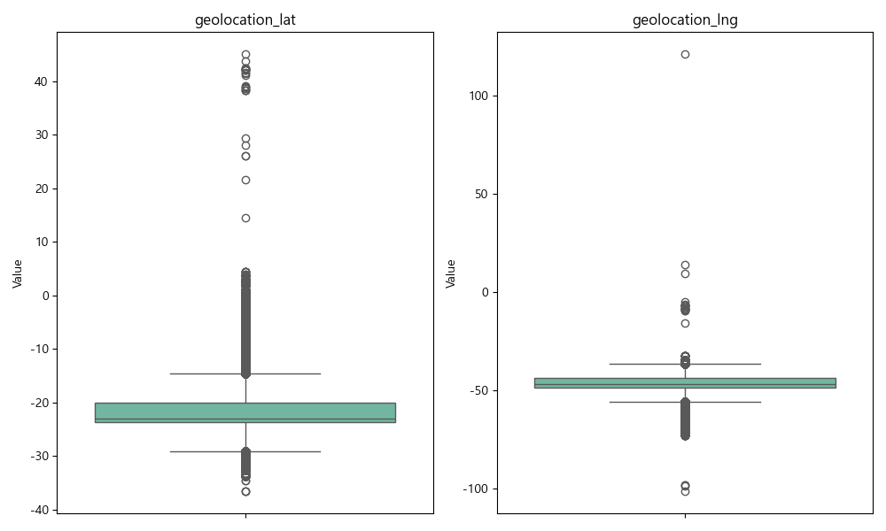
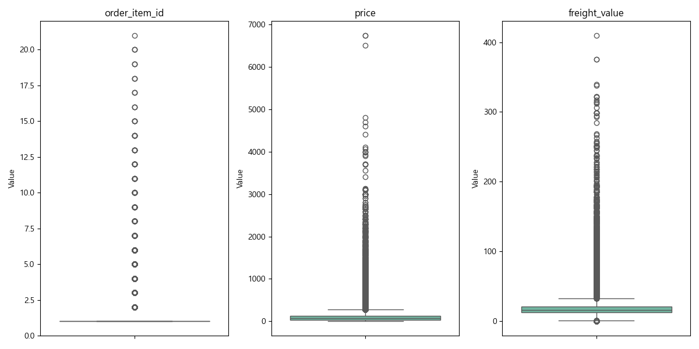
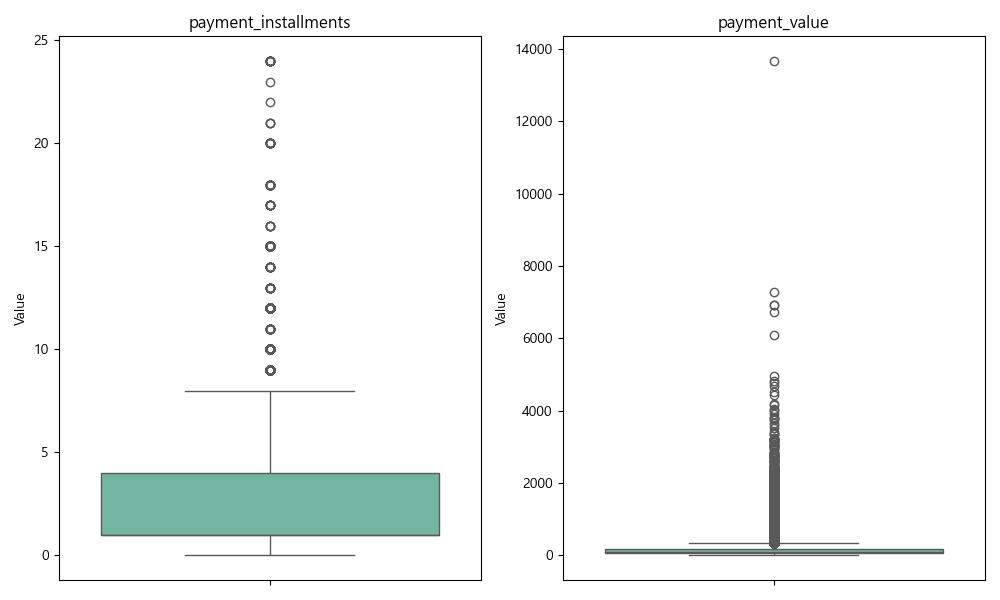
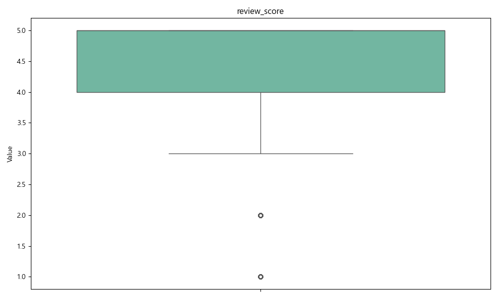
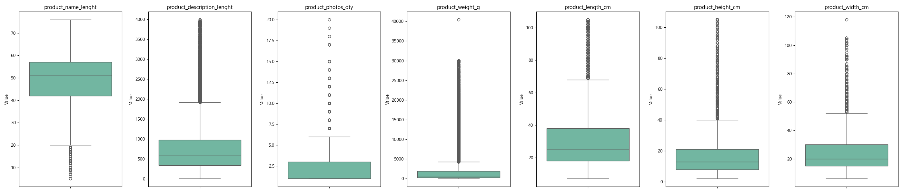

# Olist 데이터셋 품질 및 기술통계 분석 보고서

본 보고서는 Olist 데이터셋의 결측치 현황, 주요 수치형 변수의 기술통계, 그리고 이상치 분석 결과를 포함합니다.

## 📊 CUSTOMERS 테이블

### 🔍 1. 결측치 현황
- ✅ 결측치 없음

### 🔢 2. 수치형 컬럼 기술통계

| 컬럼 | count | mean | std | min | 25% | 50% | 75% | max |
| :--- | :---: | :---: | :---: | :---: | :---: | :---: | :---: | :---: |
| customer_zip_code_prefix | 99441 | 35137.47 | 29797.94 | 1003.00 | 11347.00 | 24416.00 | 58900.00 | 99990.00 |

---

## 📊 GEOLOCATION 테이블

### 🔍 1. 결측치 현황
- ✅ 결측치 없음

### 🔢 2. 수치형 컬럼 기술통계

| 컬럼 | count | mean | std | min | 25% | 50% | 75% | max |
| :--- | :---: | :---: | :---: | :---: | :---: | :---: | :---: | :---: |
| geolocation_zip_code_prefix | 1000163 | 36574.17 | 30549.34 | 1001.00 | 11075.00 | 26530.00 | 63504.00 | 99990.00 |
| geolocation_lat | 1000163 | -21.18 | 5.72 | -36.61 | -23.60 | -22.92 | -19.98 | 45.07 |
| geolocation_lng | 1000163 | -46.39 | 4.27 | -101.47 | -48.57 | -46.64 | -43.77 | 121.11 |

### 📈 3. 이상치 분석 (Boxplot)

---

## 📊 ORDER_ITEMS 테이블

### 🔍 1. 결측치 현황
- ✅ 결측치 없음

### 🔢 2. 수치형 컬럼 기술통계

| 컬럼 | count | mean | std | min | 25% | 50% | 75% | max |
| :--- | :---: | :---: | :---: | :---: | :---: | :---: | :---: | :---: |
| order_item_id | 112650 | 1.20 | 0.71 | 1.00 | 1.00 | 1.00 | 1.00 | 21.00 |
| price | 112650 | 120.65 | 183.63 | 0.85 | 39.90 | 74.99 | 134.90 | 6735.00 |
| freight_value | 112650 | 19.99 | 15.81 | 0.00 | 13.08 | 16.26 | 21.15 | 409.68 |

### 📈 3. 이상치 분석 (Boxplot)

---

## 📊 ORDER_PAYMENTS 테이블

### 🔍 1. 결측치 현황
- ✅ 결측치 없음

### 🔢 2. 수치형 컬럼 기술통계

| 컬럼 | count | mean | std | min | 25% | 50% | 75% | max |
| :--- | :---: | :---: | :---: | :---: | :---: | :---: | :---: | :---: |
| payment_sequential | 103886 | 1.09 | 0.71 | 1.00 | 1.00 | 1.00 | 1.00 | 29.00 |
| payment_installments | 103886 | 2.85 | 2.69 | 0.00 | 1.00 | 1.00 | 4.00 | 24.00 |
| payment_value | 103886 | 154.10 | 217.49 | 0.00 | 56.79 | 100.00 | 171.84 | 13664.08 |

### 📈 3. 이상치 분석 (Boxplot)

---

## 📊 ORDER_REVIEWS 테이블

### 🔍 1. 결측치 현황
| 컬럼명 | 결측치 수 | 비율 (%) |
| :--- | :---: | :---: |
| review_comment_title | 87,656 | 88.34% |
| review_comment_message | 58,247 | 58.70% |

### 🔢 2. 수치형 컬럼 기술통계

| 컬럼 | count | mean | std | min | 25% | 50% | 75% | max |
| :--- | :---: | :---: | :---: | :---: | :---: | :---: | :---: | :---: |
| review_score | 99224 | 4.09 | 1.35 | 1.00 | 4.00 | 5.00 | 5.00 | 5.00 |

### 📈 3. 이상치 분석 (Boxplot)

---

## 📊 ORDERS 테이블

### 🔍 1. 결측치 현황
| 컬럼명 | 결측치 수 | 비율 (%) |
| :--- | :---: | :---: |
| order_approved_at | 160 | 0.16% |
| order_delivered_carrier_date | 1,783 | 1.79% |
| order_delivered_customer_date | 2,965 | 2.98% |

---

## 📊 PRODUCTS 테이블

### 🔍 1. 결측치 현황
| 컬럼명 | 결측치 수 | 비율 (%) |
| :--- | :---: | :---: |
| product_category_name | 610 | 1.85% |
| product_name_lenght | 610 | 1.85% |
| product_description_lenght | 610 | 1.85% |
| product_photos_qty | 610 | 1.85% |
| product_weight_g | 2 | 0.01% |
| product_length_cm | 2 | 0.01% |
| product_height_cm | 2 | 0.01% |
| product_width_cm | 2 | 0.01% |

### 🔢 2. 수치형 컬럼 기술통계

| 컬럼 | count | mean | std | min | 25% | 50% | 75% | max |
| :--- | :---: | :---: | :---: | :---: | :---: | :---: | :---: | :---: |
| product_name_lenght | 32341 | 48.48 | 10.25 | 5.00 | 42.00 | 51.00 | 57.00 | 76.00 |
| product_description_lenght | 32341 | 771.50 | 635.12 | 4.00 | 339.00 | 595.00 | 972.00 | 3992.00 |
| product_photos_qty | 32341 | 2.19 | 1.74 | 1.00 | 1.00 | 1.00 | 3.00 | 20.00 |
| product_weight_g | 32949 | 2276.47 | 4282.04 | 0.00 | 300.00 | 700.00 | 1900.00 | 40425.00 |
| product_length_cm | 32949 | 30.82 | 16.91 | 7.00 | 18.00 | 25.00 | 38.00 | 105.00 |
| product_height_cm | 32949 | 16.94 | 13.64 | 2.00 | 8.00 | 13.00 | 21.00 | 105.00 |
| product_width_cm | 32949 | 23.20 | 12.08 | 6.00 | 15.00 | 20.00 | 30.00 | 118.00 |

### 📈 3. 이상치 분석 (Boxplot)

---

## 📊 SELLERS 테이블

### 🔍 1. 결측치 현황
- ✅ 결측치 없음

### 🔢 2. 수치형 컬럼 기술통계

| 컬럼 | count | mean | std | min | 25% | 50% | 75% | max |
| :--- | :---: | :---: | :---: | :---: | :---: | :---: | :---: | :---: |
| seller_zip_code_prefix | 3095 | 32291.06 | 32713.45 | 1001.00 | 7093.50 | 14940.00 | 64552.50 | 99730.00 |

---

## 📊 CATEGORY_TRANSLATION 테이블

### 🔍 1. 결측치 현황
- ✅ 결측치 없음

---

